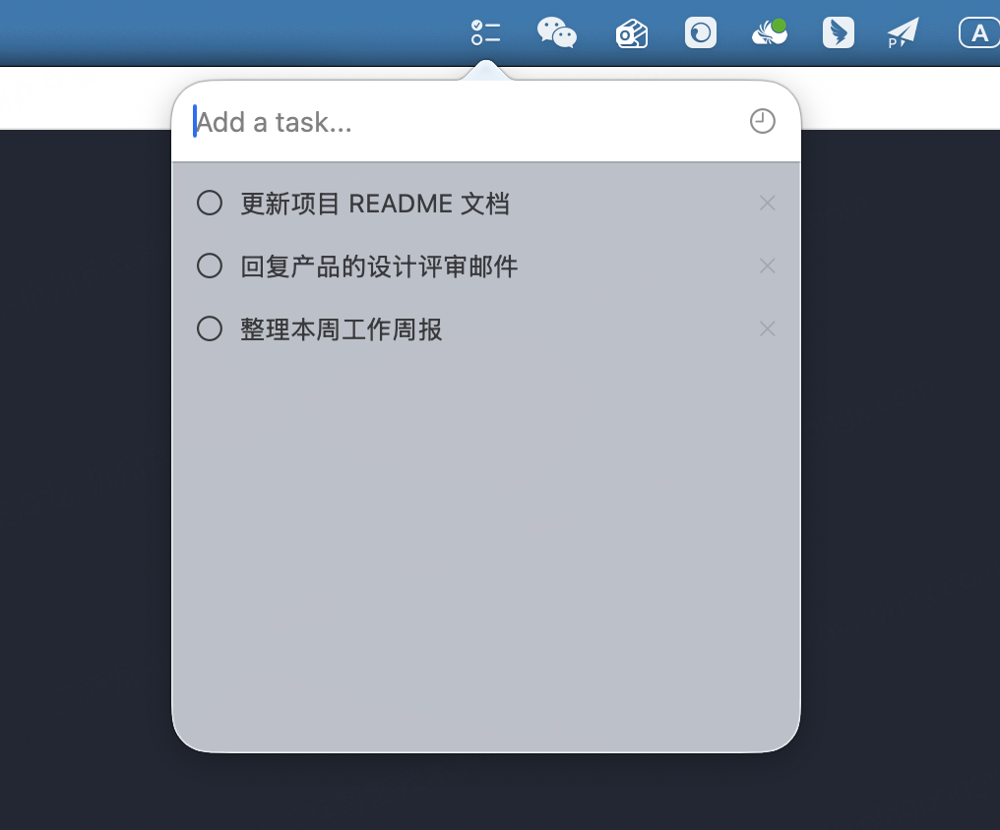
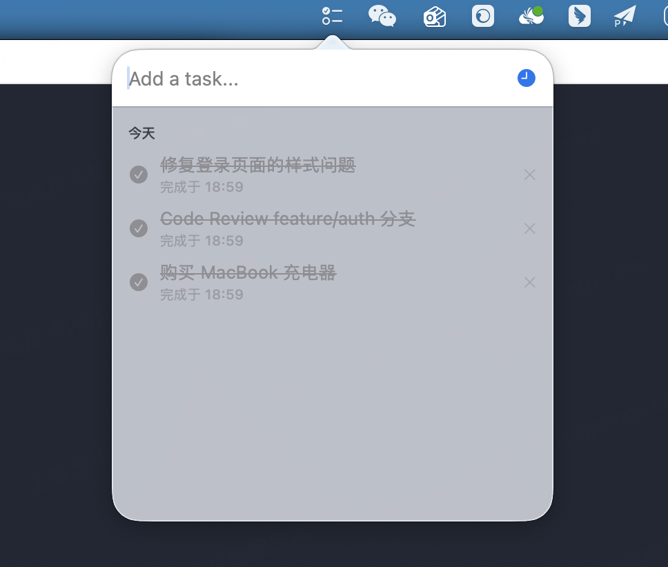

# TodoList

一款专为自用打造的 macOS 菜单栏 Todo App。无独立窗口、不占 Dock 栏，点击状态栏图标即可记录任务，用完即走，不打扰工作流。

## 预览

| 待办任务 | 历史记录 |
|:---:|:---:|
|  |  |

## 系统要求

- macOS 12.0+
- Xcode 14.0+

## 运行方式

1. 克隆仓库

   ```bash
   git clone https://github.com/HarlonWang/TodoList.git
   cd TodoList
   ```

2. 用 Xcode 打开项目

   ```bash
   open TodoList.xcodeproj
   ```

3. 选择 `My Mac` 作为运行目标，点击运行（`⌘R`）

## License

MIT
